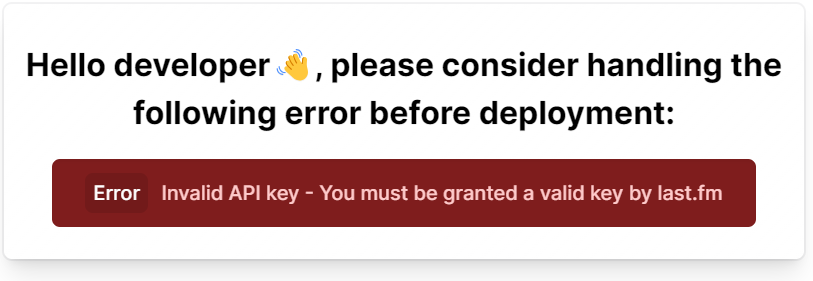
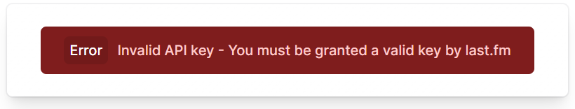

# @lastfm-viewer/svelte

> [!NOTE]
> This repository is now part of a monorepo if you want to start developing on it go to the original monorepo [here](https://github.com/ZOASR/lastfm-viewer)

## Homepage: [lastfm-viewer.vercel.app](https://lastfm-viewer.vercel.app)

<p align="center" >
  
</p>

<p align="center" >

<a href="https://www.npmjs.com/package/@lastfm-viewer/svelte" alt="@lastfm-viewer/svelte(npm)">
</a>
</p>

A sveltejs component to view recent scrobbles for a last.fm user

<p align="center">
  
  
</p>

## Quick start

Install it:

```bash
npm i @lastfm-viewer/svelte
# or
yarn add @lastfm-viewer/svelte
# or
pnpm add @lastfm-viewer/svelte
# or
bun i @lastfm-viewer/svelte
```

Install peer dependencies:

```bash
npm i -D @lastfm-viewer/ui @lastfm-viewer/utils
# or
pnpm i -D @lastfm-viewer/ui @lastfm-viewer/utils
# or
yarn add -D @lastfm-viewer/ui @lastfm-viewer/utils
# or
bun i -D @lastfm-viewer/ui @lastfm-viewer/utils
```

<p align="center">

</p>

Use it:

to start using the component you first need to get a last.fm API key from [here](https://www.last.fm/api), once you've done that just import the component and specify the username of the user you want to get scrobbling information from:

> Please note that some users set their profile stats to private, so not every user is applicable, if you're using this component on your personal account just set your "Recent listening" stats to public [here](https://www.last.fm/settings/privacy)

```svelte
<script>
	import { SvelteLastFMViewer } from '@lastfm-viewer/svelte';
	import '@lastfm-viewer/ui/styles';
	import '@lastfm-viewer/ui/styles/LastFMViewer.css';
	import '@lastfm-viewer/ui/styles/PastTracks.css';
	import '@lastfm-viewer/ui/styles/TrackProgressBar.css';
	import '@lastfm-viewer/ui/styles/CardFooter.css';
	import '@lastfm-viewer/ui/styles/ErrorView.css';
</script>

<SvelteLastFMViewer user="[username]" />
```

<p align="center">

</p>

## Props:

### `user: string` :

last.fm username

<p align="center">

</p>

### `updateInterval?: number` :

if you want to frequently fetch the user's listening info just specify the `updateInterval` prop. (milliseconds) (it takes a number that determines the update interval):

```svelte
<script>
	import { SvelteLastFMViewer } from "@lastfm-viewer/svelte";
</script>

<SvelteLastFMViewer
	user="[username]"
	updateInterval={20000} {/* 20 seconds */}
/>
```

<p align="center">

</p>

### `mode?: ("dev" | "prod")` = `"dev"` :

The default value for this prop is: `"dev"`

when using `"dev"` mode any error that haapens will be viewed with the following message above it:

`Hello developer👋, please consider handling the following error before deployment:`



when using `"prod"` mode the error is shown as is:


